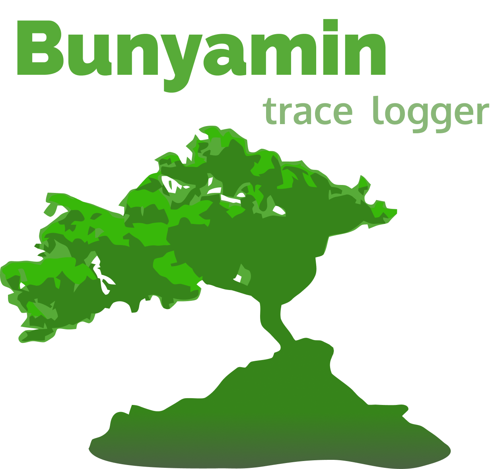
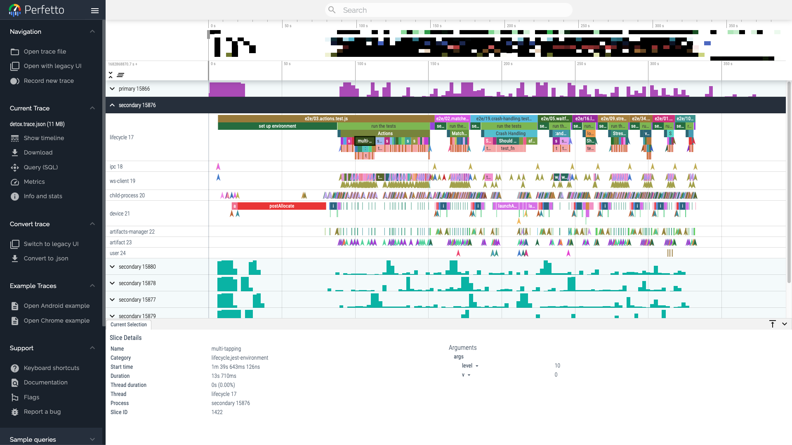
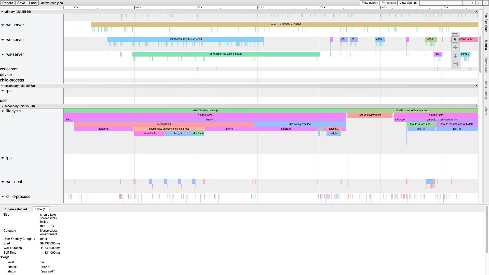

<table align=center><tr><td rowspan=2 width="355px">
  
</td><td colspan="2" height="300" valign="top">

- Based on top of [node-bunyan](https://github.com/trentm/node-bunyan).
- Generated logs can be viewed in [Perfetto UI](https://ui.perfetto.dev), `chrome://tracing` and other debugging tools.
- Multiple log levels, including `fatal`, `error`, `warn`, `info`, `debug`, and `trace`.
- Customizable metadata for logging events, including event categories and custom properties.
- Support for logging duration events, with the ability to stack events and mark them as completed.
- Aggregation of multi-process logs for advanced use scenarios.

[](https://github.com/semantic-release/semantic-release)
[](http://commitizen.github.io/cz-cli/)

</td></tr><tr><td align="center">
  
</td><td align="center">
  
</td></tr></table>

**Bunyamin** is a powerful logging and event tracking library that provides detailed information on the performance and behavior of your application. Originally developed as part of the [Detox](https://wix.github.io/Detox/) testing framework, Bunyamin can be used in a wide range of Node.js applications and libraries.

## Getting Started

To install the Bunyamin, run the following command:

```sh
npm install bunyamin --save
```

Once you have installed the logger, you can import it into your application and start logging events as you would
normally do with Bunyan:

```js
import { createLogger, traceEventStream } from 'bunyamin';

const logger = createLogger({
  name: 'my-app',
  streams: [
    traceEventStream({ outFile: '/path/to/trace.json', loglevel: 'trace' }),
  ],
});

logger.info('Hello, world!');
```

## API

### Log Levels

Bunyamin provides several log levels that you can use to categorize your log messages:

* `fatal`,
* `error`,
* `warn`,
* `info`,
* `debug`,
* `trace`.

Each log level has a corresponding method on the logger instance, e.g.:

```js
logger.info('This is an informational message');
logger.warn('This is a warning message');
logger.debug('This is a debug message');
```

You can also include additional metadata with your log messages by passing an object as the first argument to the log method:

```js
logger.info({ cat: 'login', user: 'user@example.com' }, 'User logged in');
```

### Duration events

This library also provides support for logging duration events, which can be used to track the duration of specific operations or functions. To log a duration event, you can use the `begin` and `end` methods:

```js
logger.info.begin({ cat: 'login' }, 'Logging in');
// ... perform login ...
logger.info.end('Login complete');
```

You can also use the `complete` method as a shorthand for logging a duration event:

```js
await logger.info.complete({ cat: 'login' }, 'Logging in', async () => {
  // ... perform login ...
});
```

The `complete` method takes an optional metadata, a message and a function or promise to execute. It logs a `begin` event with the message before executing the function or promise, and a corresponding `end` event when the function or promise completes. Depending on the result of the operation, it might attach a boolean `$success` result and `$error` object.

### Metadata

You can attach custom metadata to your log messages and duration events by passing an object as the first argument to the log method or event method. For example:

```js
logger.info({ event: 'login', user: 'johndoe@example.com' }, 'User logged in');
logger.info.begin({ event: 'login' }, 'Logging in');
```

The LogEvent type provides a structure for defining metadata objects:

```ts
type LogEvent = {
  id?: string | number;
  cat?: string | string[];
  cname?: string;
  pid?: never;
  tid?: never;
  ts?: never;
  ph?: never;
  [customProperty: string]: unknown;
};
```

The `id` property can be used to assign an ID to the event, which can be helpful when logging concurrent or overlapping events.

### Child Loggers

You can create a child logger with a specific context by calling the `child` method on the parent logger:

```js
const childLogger = logger.child({ component: 'Login' });
childLogger.info('Logging in');
```

The child logger inherits the log level and configuration options of the parent logger, but any additional metadata provided to the child logger is merged with the parent context.

## Contributing

Contributions to Bunyamin are welcome! If you would like to contribute, please read our [contributing guidelines](CONTRIBUTING.md) and submit a pull request.

## License

Bunyamin is licensed under the [MIT License](LICENSE).
